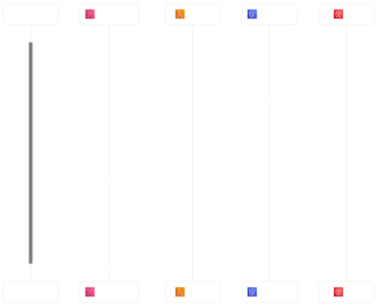

# Lambda Subscriber Service

## Overview

This project is a serverless subscriber service which individuals can use to build their own independent subscriber base for a dev blog, mailing list, or newsletter. This serverless subscriber service handles subscription requests, confirmations, unsubscribe requests, and resubscribe requests. This service uses the double opt-in method to avoid fake sign ups and ensure that every sign up email address is for a valid, monitored inbox.

## Architecture

1. **Subscription Request**:

   - User submits their email through the API gateway.
   - API gateway triggers a Lambda function.
   - Lambda function adds the email to the DynamoDB table and sends a verification email using SES.

2. **Subscription Verification**:

   - User clicks the verification link in the email.
   - Another API gateway endpoint is called.
   - The corresponding Lambda function updates the user's subscription status to true in DyanmoDB

3. **Unsubscribe Request**

   - User clicks link to unsubscribe (unsubscribe link provided in each email)
   - API Gateway unsubscribe endpoint is called with user token
   - Corresponding Unsubscribe Lambda function updates user subscription status to false in DyanmoDB

4. **(Optional) Resubscribe**

   If you want to include a resubscribe option in your UI upon unsubscribing in-case of mistakes or change of mind

   - User clicks link to resubscribe
   - API gateway resubscribe endpoint is called and passes user unique token to resubscribe lambda function
   - Lambda function updates the user's subscription status to true in DyanmoDB

## Getting Started

### Prerequisites

- AWS account
- AWS CLI, configured with your account

### Deployment

1. **Deploy the API Gateways**:

   - Navigate to the AWS Management Console.
   - Create a new API in API Gateway.
   - Configure endpoints for subscription and verification.

2. **Deploy Lambda Functions**:

   - Create Lambda Functions for handling subscriptions, verifying subscriptions, and unsubscribing *(or use the ones in this repo)*.
   - Ensure the functions have access to SES and DynamoDB *(Assign appropriate AWS IAM Roles)*.

3. **Set up DynamoDB**:

   - Create a new table in DynamoDB to store subscriber information.

4. **Configure SES**:
   - Verify your domain or email address in SES.
  
5. **(Optional) Automate deployment with GitHub Actions** 
   - Edit the deployment file provided in this Repo to automate your Lambda deployments
   - Add your aws-access-key-id and  aws-secret-access-key to your GitHub actions secrets *(Make sure not to include them in your deployment file)*

### AWS Usage Cost

Given that this service is serverless in nature, and given AWS's generous always-free tier for AWS Lambda and DynamoDB, this service will be virtually always available, and have negligible cost for a low-traffic site like a personal blog.

- AWS Lambda offers 1 million free requests per month
- DynamoDB offers 25GB of free storage
- SES pricing sits at just $0.10 per 1,000 emails you send or receive.
- API Gateway charges $3.50 per 1 million requests sent  
  
In total, **1000 subscriptions would incur only an ~$0.11 charge on AWS.**  

### Usage

To subscribe, users should send a POST request to the subscription endpoint with their email address. They will then receive a verification email. By clicking the verification link, their subscription will be confirmed, and then they are redirected to a confirmation page.

## Security Considerations

Ensure that your API gateway and Lambda functions are secured and only accessible as intended. Use AWS IAM roles and policies to control access. Ensure use of environment variables and secrets for all AWS access keys and sensitive information. Optionally also **consider rate limiting your API gateway endpoints**; since subscribing is generally a one time action, there really shouldn't be a large number of requests coming from a given user. 
